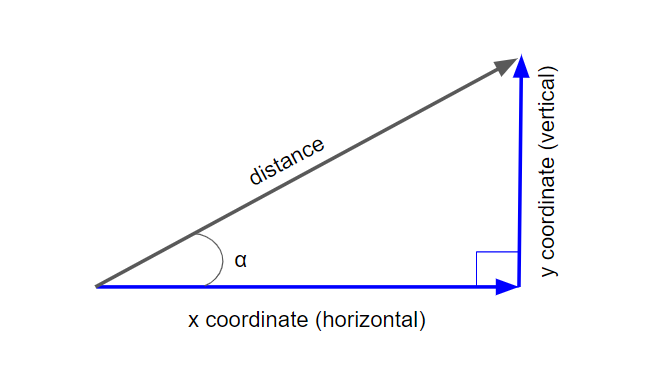
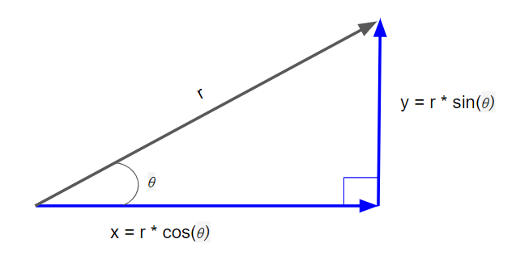

# 01 &mdash; Vectors in the 2D Plane
> (TBD)

## Introduction
Models of 2D entities are important in programming. Anything that shows up on the screen is a 2D object occupying some width and height of pixels.

Vectors are objects that live in multi-dimensional spaces. They have their own notions of arithmetic (adding, multiplying, and so on). This sections deals with 2D vectors.

The 2D world is referred to as *plane* and objects living in a 2D plane has two dimensions: width and height. Locations in the plane are identified by their vertical and horizontal positions, typically referred to a reference point: the *origin* of the plane.

A 2D vector is a point in the plane relative to the origin. 2D vectors are represented laying out in the plane two perpendicular axes that intersect at the origin of the plane. The horizontal axis is called the *x-axis* and the vertical one is called the *y-axis*.

Points in the plane are represented by their position with respect with those axes, for example `(6, 4)` which represent the value of the *x* and *y* coordinates of the point.

## Drawing in 2D using Python
We will be using a small set of custom-built functions to create drawings, built on top of `Matplotlib`.

The following table lists some Python classes representing geametric figures, usable with a function called `draw()` that takes as input these classes.

| Class | Constructor Example | Description |
| :---- | :------------------ | :---------- |
| `Polygon` | `Polygon(*vectors)` | Draws a polygon whose vertices are represented by a list of vectors. |
| `Points` | `Points(*vectors)` | Represent a list of points to draw. |
| `Arrow` | `Arrow(tip, [tail])` | Draws an arrow from the origin to the tip of the vector, or from the tail vector to the tip vector if `tail` is given. |
| `Segment` | `Segment(start, end)` | Draws a line segment from the start vector to the end vector. |

There are few extra options you can pass to the `draw()` function:

+ `grid=(x_unit, y_unit)` &mdash; use x_unit, y_unit values for each of the x-axis and y-axis unit step
+ `nice_aspect_ratio` &mdash; instructs `draw()` not to keep the x-axis and y-axis scales the same

## Plane Vector Arithmetic
Like numbers, vectors have their own kind of arithmetic. Note that operations from vector arithmetic accomplish useful geometric transformations that can be visualized in the 2D plane.

### Vector Addition
Given two input vectors:

```
v1 = (v1_x, v1_y)
v2 = (v2_x, v2_y)

v1 + v2 = (v1_x + v2_x, v1_y + v2_y)
```

The rule for vector addition is sometimes called *tip-to-tail* addition because if you move the tail of the second vector to the tip of the first the sum is the arrow from the start of the first vector to the end of the second.

That is, adding a vector has the effect of moving (*translating* in Maths terms)

### Vector Components and Lengths
Many times it's usefult to decompose a vector as a sum of other vectors. For example, when using walk directions it is easier to say "*go 4 blocks east, then 3 blocks north*" rather than "*go 800 meters northeast*".

As an example, the vector `(4, 3)` can be represented as `(4, 0) + (0, 3)` which are called the x and y components of the `(4, 3)` vector.

The length of the vector is the length of the arrow that represents it, that is, the distance from the origin of the plane to the point that represents it.

If we recall the *Pythagorean theorem*:
> For a right triangle (a triangle having two sides meeting at a 90°), the square of the length of the longest side (hypotenuse) is the sum of the squares of the lengths of the other two sides.

Therefore, the length of the vector `(4, 3)` would be `√(4^2 + 3^2)

### Multiplying Vectors by Numbers
Repeated addition of vectors in *unambiguous*: you can keep stacking vectors using the *tip-to-tail* method as required.

The effect of adding a vector to itself a certain number of times can be represented as the product of multiplying a vector by a number. This is called *scalar multiplication*, as ordinary numbers are often called *scalars*. Also, *scalar* resembles *scale* and that's exactly the geometry interpretation of the *scalar product*: multiplying a given vector `v` by 2.5 scales `v` 2.5 times.

It is also interesting the fact that *scalar multiplication* of a vector scales both components by the same factor.
That is:

```
v = (a, b) = (a, 0) + (0, b)
r * v = r*(a, b) = (r*a, r*b) = (r*a, 0) + (0, r*b) = r*(a, 0) + r*(0, b)
```

This is true for any `r` including negative numbers, who have the effect of changing the direction of the vector to the opposite of the original one.

### Subtraction, displacement, and distance
Given a vector `v`, the negative vector `-v`, is the same as the scalar product `-1 * v`. Thus, `(-4, 3)` is the opposite of `(4, -3)`. The length of both `v` and `-v` will have the same length, but will point in the opposite direction.

*Vector subtraction* can be defined as:
`v - w = v + (-w)`

In geometry terms, `v - w` is the position of `v` relative to `w`.

In terms of coordinates, subtraction can be defined as:
```
v = (a, b), w = (c, d)
v - w = (a - c, b - d)
```

The difference for the vectors is sometimes call the displacement from `v` to `w`.

The distance between `v` and `w` is the length of the displacement vector.

### Angles and Trigonometry in the Plane

In the same way that we can use the x and y coordinates to uniquely characterize vectors in the plane, we can also characterize them by their length and the angle measured from the x axis.

For example, we could say the vector of length 5 units, which points in the direction 37° counterclockwise from the positive half of the x-axis.
`v=(5, 37°)`.

These numbers are called the *polar coordinates* and are just as good as the `v=(4, 3)` coordinates we have used thus far, and that are known as *Cartesian coordinates*.

| NOTE: |
| :---- |
| *Cartesian coordinates* are appropriate when we're dealing with addition, translation and displacement of vectors, while *polar coordinates* are more appropriate when we're dealing with distances and rotations of vectors. |

Both coordinate systems are compatible and we can switch between one and the other using trigonometric functions.

For a given angle, there is an interesting property on the cartesian coordinates of the points along the line defined by that angle: the ratio between the x and y coordinate stays the same along the line.

For example:
+ for a 45° angle, the ratio `y/x` is 1 &mdash; for each x unit you go right, you go one y unit up
+ for a 116.57° angle, the ratio `y/x` is -2, &mdash; for each x unit you go left, you go 2 units up
+ for a 200° angle, the ratio `y/x` is 0.36 &mdash; for each x unit you go left, you go 0.36*x units down

This ratio is called the *tangent* of the angle and is denoted as `tan(α)` with α being the angle. The tangent is related to the transformation from *polar* to *Cartesian* coordinates systems, as it gives us the vertical distance covered divided by the horizontal distance, but we need two other trigonometric functions: *sine* and *cosine*.

The *sine* and *cosine* give us the vertical and horizontal distance covered relative to the overall distance.

Let's take a look at the following schematic:


Then:
```
sin(angle)=(vertical/distance)
cos(angle)=(horizontal/distance)
tan(angle)=(vertical/horizontal)
```

Now we have all the necessary elements at hand to convert from *polar* to *Cartesian* coordinates:

```
v=(r, θ) = (r*cos(θ), r*sin(θ))
```



In general, calculators and computers do not use *degrees* as the default unit for angles, but use *radians* instead. The relationship between the two units is established through 𝜋:

```
𝜋 radians = 180°
```

That is, in radians, half a trip around a circle is an angle of 𝜋, and therefore, the whole revolution is 2*𝜋.

With all this information we're in a good position to:
+ transform *degrees* to *radians* and *radians* to *degrees*
+ transform the *polar coordinates* of a vector into its *Cartesian* equivalent

```python
def to_cartesian(polar_vector):
    length, angle = polar_vector[0], polar_vector[1] # this is like destructuring
    return (length * cos(angle), length * sin(angle))

def to_radians(degrees):
    return (degrees * pi) / 180

def to_degrees(radians):
    return (radians * 180) / pi
```

However, we cannot still transform the *Cartesian coordinates* into its *polar* equivalent. In order to do that, we need to define the inverse trigonometric functions of the *tangent*, *sine* and *cosine*, namely the *arctangent*, *arcsine* and *arccosine*.

```
asin(sin(angle)) = angle
acos(cos(angle)) = angle
atan(tan(angle)) = angle
```

Yet however, with the inverse trigonometric functions won't give us the answer as there are several angles whose sine give us the same number, and the same happens for the *cosine* and the *tangent*.

In order to get the correct angle we need to use the `atan2(vertical, horizontal)` function, which is an *arctangent* function implementation that considers the signs of the coordinates to give us the right value.

As such, we can finally implement the `to_polar()` function:

```python
def to_polar(vector):
    x, y = vector[0], vector[1] # destructuring
    angle = atan2(y, x)
    return (length(vector), angle)
```

## Transforming Collections of Vectors
Collections of vectors store spatial data in the 2D plane, regardless of what coordinate system we use. However, we have already seen that Cartesian system is very conducive to *translation* (movement of vectors) and the polar system is conducive to angle related operations such as rotations, as it has the angle built into its representations.

In polar coordinates, adding to the angle rotates a vector further counterclockwise, while subtracting from it rotates the vector clockwise.